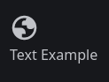

# Welcome to our contributing guide!

The wiki (and piracy in general) is all about community - thus, we welcome any and all contributions. There's many ways you can help out:

* [Adding and drafting](#adding-and-drafting) pages
  - Also using [custom components](#custom-components) if you're feeling fancy
* Fixing up any [incomplete pages](#incomplete-pages)
* [Translating](#translating) any completed pages

If you don't feel comfortable writing, don't worry! You can still support the project by sharing it to other people, or starring the repo.

## Adding and Drafting
This site is still in an early state, and although and handful of pages have been added (as a stub), there's bound to be some we missed.

To add a page to the wiki, we recommend either drafting it and [making a PR,](https://docs.github.com/en/pull-requests/collaborating-with-pull-requests/proposing-changes-to-your-work-with-pull-requests/creating-a-pull-request) or by proposing a page in [GH Discussions.](https://github.com/nullish-cat/thepiracywiki/discussions)

We don't try to set any limits, so you can write however much you want! We do have some general guidelines though:

* Try to keep it related to piracy.
  - This is, first and foremost, a wiki for piracy. You can have topics related to it, such as adblockers and download managers, but try not to steer too far off the pirate route.
* Keep it human-readable and simple.
  - Although the names are similar, this is not Wikipedia! We want to keep the wiki available to *everyone,* not just the knowledgable and tech savvy. Thus, try not to get too technical unless necessary. (If needed, you can mark the section as "Technical" or "Advanced.")
* Try and follow our general formatting and style.
  - It's recommended to read at last one or two of our guides, preferrably their source code, to get a general feel for the writing style and structure. This isn't required, but it helps to keep a consistent flow throughout the site.

If this is your first time using Markdown, please see [this guide.](https://www.markdownguide.org/basic-syntax/) If this is your first time using MDX / Starlight, please refer to [the Starlight docs.](https://starlight.astro.build/)

## Images / Screenshots
Images are important for providing visual context for many of the guides. You can place images in the following folder structure:
`/src/assets/[page name]/image.png`

For screenshots, please annotate as needed. You can use the following software (depending on OS) for this:
* For Windows, use [ShareX.](https://getsharex.com/) If possible, use 10 or 11.
  - Please do not use alternatives such as Snipping Tool or Lightshot to maintain consistency.
* For Mac, use [Shottr.](https://shottr.cc/)
* For Linux, use [Flameshot](https://flameshot.org/) for GNOME and [Spectacle](https://apps.kde.org/spectacle/) for KDE.
* For Android and iOS, take one with the device's built in screenshot function. If it needs to be annotated, please send the file to your computer, and use ShareX's image editor.
  - If the screenshot only needs to be cropped, you don't need to worry about this.
  - The majority of mobile device's screenshotting tools only involve drawing, which is understandable, but will mess with the general style of the wiki. Thus the need to annotate using ShareX.
  - You can send files from your phone to a PC using [LocalSend.](https://localsend.org/)

It should be noted that unless the guide calls for using a different operating system, screenshots should be kept to Windows only.

## Custom Components
Alongside the regular [Starlight components,](https://starlight.astro.build/guides/components/) we have a few custom components that extend the built-in ones.

### Cards
This is the same as Starlight's [cards,](https://starlight.astro.build/guides/components/#cards) with the notable addition of astro-icon support.

**Usage:**
```astro
import Card from "../../../components/Card.astro";

<Card title="Test" icon="material-symbols:globe">
  Hello, World!
</Card>
```


### Icons
This project uses [Astro-Icon](https://astroicon.dev/) and [Material Symbols](https://icon-sets.iconify.design/material-symbols/) to provide custom icons. This component is likely unneccessary to use outside of custom components.

**Usage:**
```astro
import { Icon } from "astro-icon/components";

<Icon name="material-symbols:globe" class="icon" size={33} /> Text Example
```


Additional icon sets can be proposed in [GH discussions](https://github.com/nullish-cat/thepiracywiki/discussions) - however, we're limiting to Material Symbols at this time to prevent any bloat and maintain consistency. (Plus, Material has over 13 thousand icons.)

When considering an icon to use, please use the **filled** version of that icon (if it exists) to keep design consistency.

## Incomplete Pages
As this wiki is still in an early state, it's likely you'll come across a page with missing or incomplete info. These will be marked as "TODO":

```astro
{/* TODO: Do thing */}
```
You can see a list of TODOs by using an IDE such as [Visual Studio Code](https://code.visualstudio.com/) or [VSCodium](https://vscodium.com/) (both with the [TODO Tree](https://marketplace.visualstudio.com/items?itemName=Gruntfuggly.todo-tree) extension), or by simply browsing the source code.

When fleshing these pages out, please follow the same guidelines as stated in the [adding and drafting](#adding-and-drafting) section. You may also want a look at the [images / screenshots](#images--screenshots) and [custom components](#custom-components) sections.

## Translating
We welcome people from all corners of the globe! We're mainly focusing on Russian and Japanese as we build up the wiki, but any language is welcome.

If your language is not added to the wiki yet, you can add it by translating the `index.mdx` file (the home page,) placing it in `src/content/docs/[ISO 639 code]/index.mdx`, and adding the following to `astro.config.mjs`:

```js
locales: {
  ...
  "ISO Code": {
    label: "Language",
    lang: "isocode"
  },
  ...
}
```

For more details, please see [Starlight's i18n guide.](https://starlight.astro.build/guides/i18n/)

We recommend only translating *completed* pages, as many are still incomplete / missing, and updates to the pages would not reflect other translated versions.