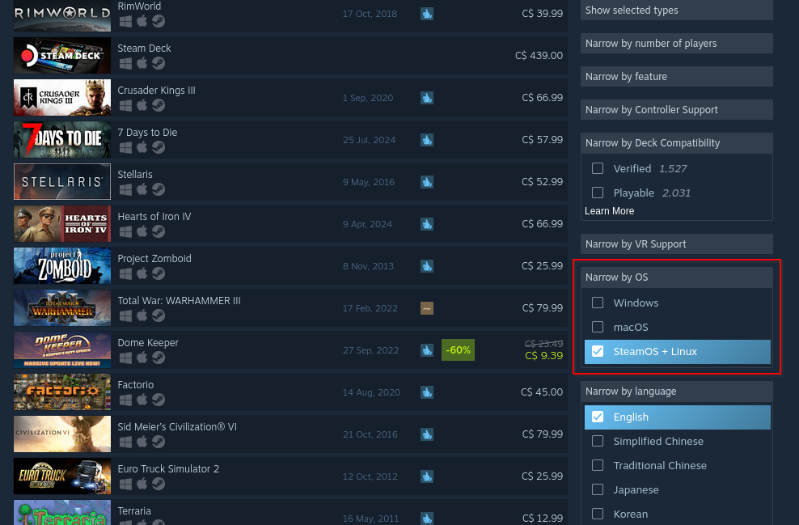

import { Aside } from "@astrojs/starlight/components"

With the arrival of the Steam Deck and software like Proton (as well as [continuous problems from Microsoft,](https://www.windowscentral.com/software-apps/windows-11/5-reasons-why-you-should-and-shouldnt-use-windows-recall-on-windows-11#section-5-reasons-not-to-use-windows-recall)) you may be one of the hundreds of people switching over to Linux every day. *(...okay, maybe not hundreds.)* Thankfully, if your software/game runs on Linux or over Wine/Proton, you don't have to give up your pirated goods.

<Aside>
  Due to the majority of Linux users being tech savvy (as it usually requires more technical literacy than other OS's), this guide is a little more technical than usual. You are expected to at least know how to use a terminal, as well as a few other things. If this is your first time using Linux, please see the following:
  * [Linux Journey](https://linuxjourney.com/)
  * [Ubuntu's "Command Line for Beginners" tutorial](https://ubuntu.com/tutorials/command-line-for-beginners#1-overview)
    - Note that the command line language, Bash, is almost universally used throughout all distros. As such, you can use this for other distros besides Ubuntu.
  * [Rim's Linux Wiki](https://rlw.pages.dev/)
</Aside>

## Native Games
The vast majority of games are only available on Windows (and thus need to be used with Proton.) However, there are a few notable titles that are native to Linux, usually indie games. You can find most by using the OS filter on Steam:

To pirate these games, you may find some on cs.rin.ru (see [our game downloading guide for details.](/guides/ddl-games)) However, there are a couple of forums with dedicated linux communities:

* [KaPiTaL SiN](https://www.kapitalsin.com/forum/index.php?board=4.0)
  - Use a translator with this one.
* [Torrminator](https://forum.torrminatorr.com/)

{/* TODO - finish this up (will do in a few hours ~ nullish)*/}

## Non-Native Games
{/* TODO */}

## Software
{/* TODO */}