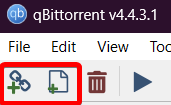
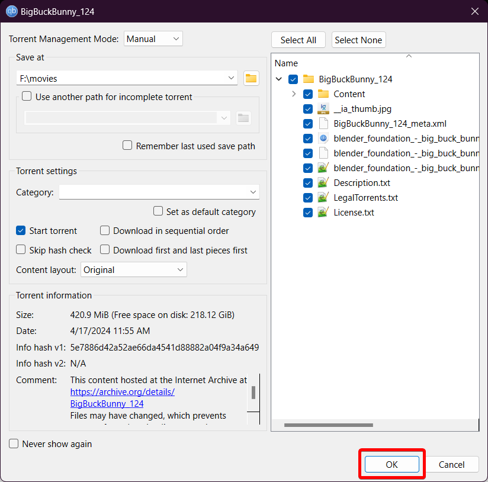

import { Aside, Icon, Tabs, TabItem } from "@astrojs/starlight/components"

You've probably heard of ThePirateBay, uTorrent, etc... but never how to actually use them and what they are. This is the subset of piracy called "torrenting" - the sites/software using the decentralized BitTorrent protocol. Torrents involve several people (sometimes with dedicated servers called "seedboxes") uploading content for people to have. They are called "seeders" and they're responsible for keeping the torrents alive and well - without a seeder, the torrent is considered dead and unobtainable. "Leechers" are usually the people downloading these files, although it can also refer to users who simply don't seed. Just a reminder, without seeders, torrents would be <ins>unobtainable,</ins> **so if you can, please seed!**

One more thing before we get on to usage - although torrents are decentralized, it is a peer to peer system, meaning your IP will be visible to all other users on the torrent. In most cases, this doesn't matter too much (all they know is that your IP is on a torrent - nobody is gonna hunt you down for that.) However, if you're in a country that cares enough (such as the US, Canada, and so on,) **your ISP may suspend your internet service.** That's why it's important to [use a VPN](/guides/vpn) if you're in an area like this.

## Setup

To start torrenting, you will need a "client" (software that lets you download/upload torrents.) The best and recommended one is [qBittorrent,](https://www.qbittorrent.org/) although you can also use [Deluge](https://www.deluge-torrent.org/) or [Transmission](https://transmissionbt.com/) (based on your personal preference.) On Android, we recommend [LibreTorrent.](https://gitlab.com/proninyaroslav/libretorrent) (Currently, there's no good torrent clients for iOS due to their store restrictions, but this may change soon as third-party stores get approved.)

<Aside type="caution">
  The most popular clients, µTorrent and BitTorrent, are not recommended. They aren't malicious, but contain ads and are largely outdated compared to the alternatives (qBittorrent, Deluge, etc.) Some downloads (like through CNET) also include adware and PUPs (Potentially Unwanted Programs.)
</Aside>

You can also [use a debrid service](/guides/debrid) such as RealDebrid, which allows for faster downloads and streaming. However, these services are usually paid.

## Leeching

Now that you have your client downloaded and installed, you need to get actual torrents. As a *legal* example, we're going to use the public domain movie ["Big Buck Bunny" by Blender](https://archive.org/details/BigBuckBunny_124) in our screenshots. There's a lot of torrent sites out there, but the ones we can recommend are:

* [1337x](https://1337x.to)
* [RuTracker](https://rutracker.org/)
* [TorrentGalaxy](https://torrentgalaxy.to/)

(This list is alphabetical and does not reflect ranking.)

<Aside>
  We do not recommend these sites for software/games, as there's a much higher risk downloading them from general trackers like these. For that, please see our respective guides.
</Aside>

There are two ways to get a torrent - either through a `.torrent` file, or through what's called a "magnet". Torrent files are self explanatory - they're files that contain torrents that you add to your client. Magnets are short codes to these torrents that allows you to directly add torrents without the need of a file (on PC for example, you can just press the "🧲 Magnet" button found on most trackers to automatically add a torrent.)

<Tabs syncKey="clients">
  <TabItem label="qBittorrent">
    To add a torrent, simply click one of these two buttons (🔗 for magnets, 📄 for files.)
    
    Then you simply press "OK" on the following pop-up (assuming you don't want to change some settings, like the
    output folder.)
    
  </TabItem>
  <TabItem label="Deluge">
    {/* TODO */}
  </TabItem>
  <TabItem label="Transmission">
    {/* TODO */}
  </TabItem>
  <TabItem label="LibreTorrent">
    {/* TODO */}
  </TabItem>
</Tabs>

Now that you have your torrent added, all you have to do is wait for it to download!

{/* TODO - General tips on increasing speeds? */}

## Seeding

Generally speaking, seeding isn't complicated and doesn't require any explanation. When you finishing downloading,
your client automatically seeds the torrent, and as long as you have the app (and your PC and network) left on,
it'll keep seeding in the background.

Of course, you can always set up a rate limit if you don't want it impacting regular use. This will limit the client's download/upload speeds to whatever you set it to.

<Tabs syncKey="clients">
  <TabItem label="qBittorrent">
    {/* TODO */}
  </TabItem>
  <TabItem label="Deluge">
    {/* TODO */}
  </TabItem>
  <TabItem label="Transmission">
    {/* TODO */}
  </TabItem>
  <TabItem label="LibreTorrent">
    {/* TODO */}
  </TabItem>
</Tabs>

If you're dedicated, you also have the option to use seedboxes. They are personal servers (either hosted online or by the user) whose main purpose is to seed torrents (although they are usually used to also stream content using a media server, like Plex or Jellyfin.) This topic is outside the scope of this guide, as it is usually paid and requires you to have some technical proficiency. You can read our seperate [seedbox guide](/guides/seedbox) to learn more.

## Streaming
While you're downloading, you can usually play videos directly from the incomplete file and watch it while you're leeching. (For the best chances, get one that uses the MKV file format.) This comes with the drawback of having to exit and relaunch the client every once in a while (as most don't auto update the file as new data gets written.)

{/* TODO - add sequential download details */}

You can also use a client that is meant for streaming, such as [WebTorrent.](https://webtorrent.io/) These are mainly meant for streaming, so it's not recommended to use these over you regular client. However, if you prefer to "stream" your movies and shows instead, you can use this.

<Aside title="Technical Info">
  The reason for this is that there's no real thing as "streaming" in torrents - you're still downloading a full video. What clients like WebTorrent do is download the file pieces in order, instead of what most clients do (which has many factors, such as availability and speed, but is generally in a random order.) This has the benefit of having a nice, clean stream of data that is suitable for watching, but it doesn't necessarily give you the fastest downloads.
</Aside>